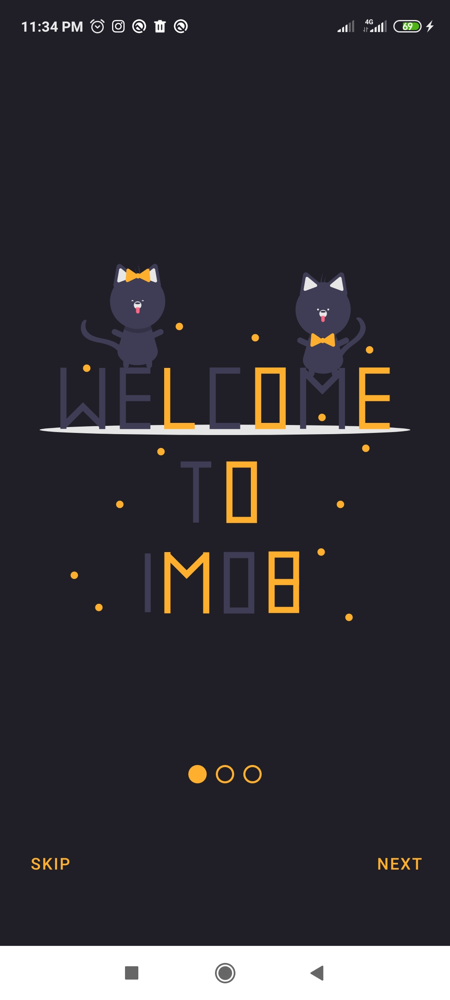
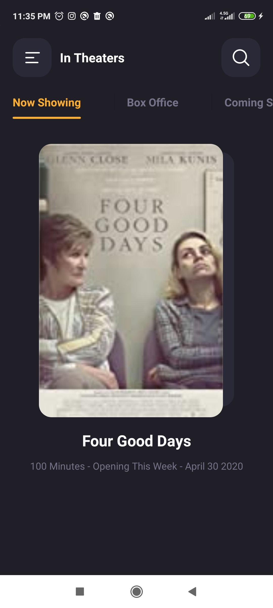
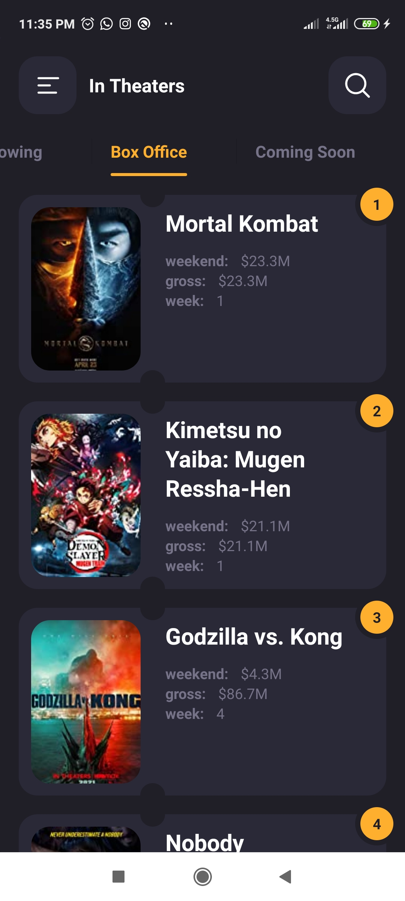
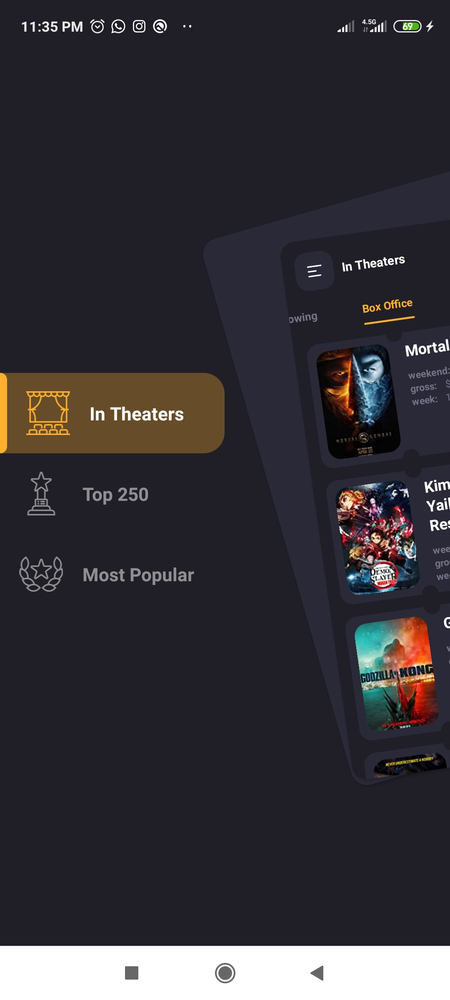
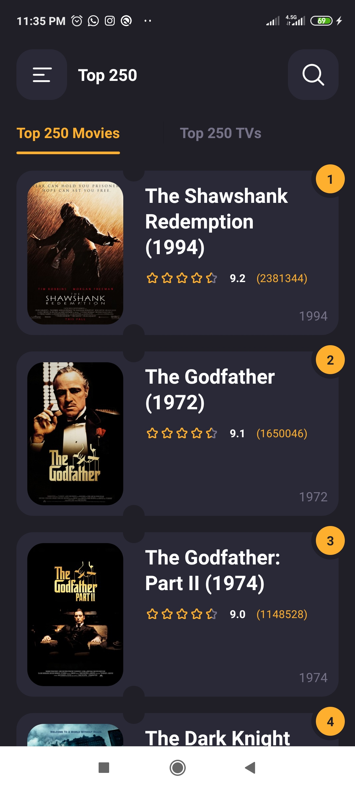
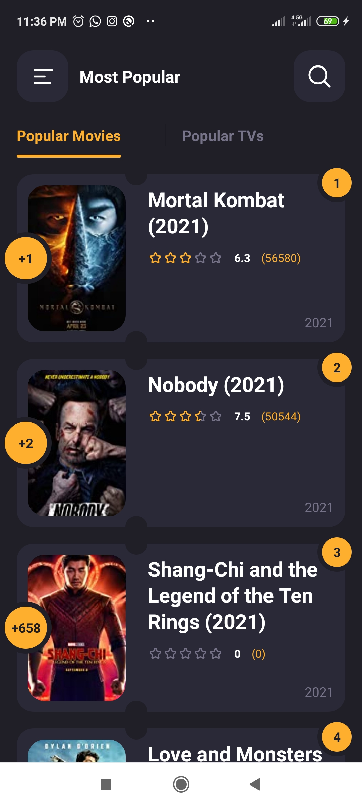
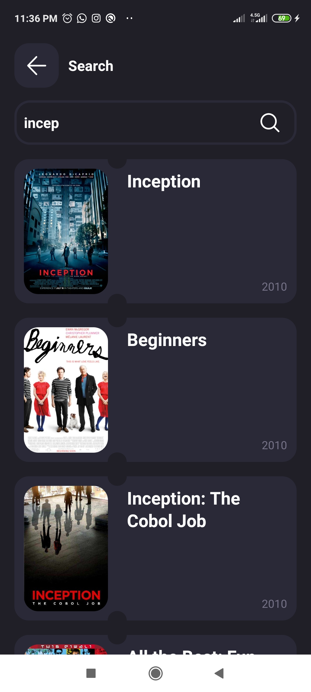
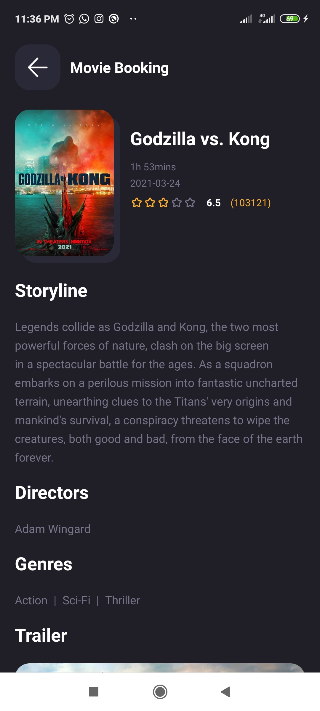
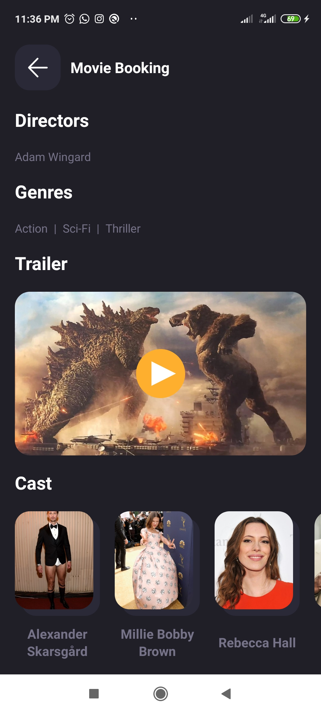

# Weather App

  
  
  

  
  
  

  
  
  

  
  See also [IMDB App Video](https://youtu.be/agl2U7ui0FE)

# Requirements
- Android Studio 4.1.1
- Android SDK 30
- Supports API Level +21

# Features
 - Material Design
 - In Theaters Movies
 - Box Office Movies
 - Coming Soon Movies
 - Top 250 Movies 
 - Top 250 TVs 
 - Most Popular Movies 
 - Most Popular TVs 
 - Search by title Movies 
 - Simple and clean
 - Beautiful UI/UX
 - Beautiful menu bar

## Built With

* Kotlin - A modern statically typed programming language
* Retrofit - A type-safe HTTP client for Android and Java
* Dagger2 - Dagger is a fully static, compile-time dependency injection framework for both Java and Android. 
* Gson - A Java serialization/deserialization library to convert Java Objects into JSON and back
* Glide - A powerful image downloading and caching library for Android
* MVVM - A powerful android design pattern
* RxJava - A programming paradigm oriented around data flows and the propagation of change i.e. it is all about responding to value changes
* ViewPager - ViewPager in Android allows the user to flip left and right through pages of data.

Used API from [imdb-api](https://imdb-api.com/)
